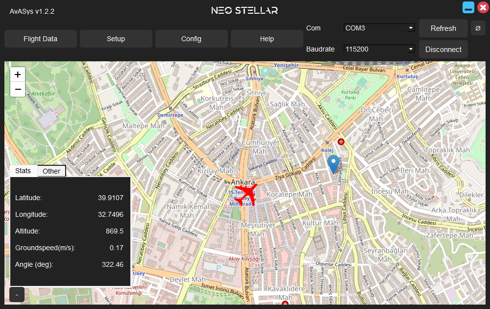

# AvASys-Ground-Control-System
AvASys Ground Control System project made with Pyside6 and using AdaFruit Ultimate GPS. This is a flight controller software used to monitor & control unmanned UAVs.
 Below is what the finished product will look like:
 
 Latest: v1.2.2
 
 
<!---->

https://github.com/SCORPIA2004/AvASys-Ground-Control-System/assets/62741526/6018f4d3-ac2c-40e2-b8bf-7c8988b248b1

